# Cotización — Guía de cambios (v4 + v5)

> **Actualizado:** junio 2026

Este documento reúne **dos capas de cambios**:

1. **Parte I — Mejoras incorporadas en v4** (commits `be0259c` y `0a58554`): ya pusheadas en el repo [Cotizador-V4](https://github.com/JPSformas/Cotizador-V4) y **heredadas por v5**, pero **aún no comunicadas al resto del equipo**. Esta sección documenta qué se agregó y en qué archivos, para que no quede implícito.
2. **Parte II — Rediseño exclusivo de v5**: cómo v5 se diferencia de esa base de v4 (toolbar dual, lock de precios, etc.). Aquí la comparación es siempre **v4 vs v5**, sin repetir las mejoras de v4 como si fueran novedades de v5.

**Screenshots (Parte II):** `comparison-screenshots/`

**Repositorios:**
- v4 → [Cotizador-V4](https://github.com/JPSformas/Cotizador-V4)
- v5 → [Cotizador-V5](https://github.com/JPSformas/Cotizador-V5)

---

## Resumen v4 vs v5

| Área | v4 | v5 |
|------|----|----|
| Mejoras Parte I (checkboxes, posición, sort, edit nav, etc.) | ✅ En repo v4 | ✅ Heredadas; sin cambio de comportamiento salvo donde indica Parte II |
| Tabla de ítems | Drag, checkboxes, sort por dropdown, reorden por posición | Misma base + toolbar dual y selección mejorada |
| Toolbar de tabla | Barra única fija (precios, ordenar, agregar, eliminar) | Dos estados: normal / selección estilo Gmail |
| Formulario superior | Setup, descuento general, cargar cantidades en columna derecha | Atajos globales reducidos + Cotizar rápido |
| Precios | Toggle texto + refresh sobre la tabla | Lock/unlock con iconos en panel lateral |
| Acciones masivas | Botón eliminar se habilita al seleccionar (sin lógica de borrado) | 6 acciones en toolbar de selección — **mockup, sin aplicar cambios** |
| Layout formulario | 50/50 | 66/33 (Información / Atajos globales) |
| Modal cantidades | Sin banner de contexto | Banner azul (selección) o amarillo (global) |
| Edición de ítems | Nav anterior/siguiente, header/footer rediseñado | Sin cambios |
| Buscador de productos | Atributos visibles en preview | Sin cambios |
| Placeholders de categoría | 11 imágenes por categoría en `IMG/` | Sin cambios |

### Estado funcional de la toolbar v5 (importante)

`cotizacion-selection-toolbar.js` es un **mockup/prototipo** (~110 líneas):

> *"Las acciones de la toolbar y los modales de cantidades son solo visuales."*

| Funcionalidad | v5 |
|---------------|-----|
| Cambio de toolbar al seleccionar filas | ✅ Funciona |
| Highlight `.row-selected` en filas | ✅ Funciona |
| Contador "N seleccionados" + limpiar selección | ✅ Funciona |
| Banners de contexto en modal cantidades | ✅ Funciona |
| "Guardar cambios" en modal cantidades | ⚠️ Solo cierra el modal |
| Aplicar descuento / setup / envío | ❌ UI sin lógica |
| Eliminar filas seleccionadas | ❌ UI sin lógica |

Lo que **sí funciona** en v5 además del mockup: checkboxes, drag-and-drop, ordenamiento, modales de productos, navegación editItem, etc.

---

# Parte I — Mejoras incorporadas en v4 (heredadas por v5)

Commits `be0259c` y `0a58554` en el repo v4. v5 las tomó en el commit inicial `2d9a4e5`. **No equivalen al “v4 que el equipo ya conoce”** — son cambios recientes que este doc deja explícitos. Donde v5 modifica algo de esta base, se indica en la columna o nota **v4 → v5**.

---

## A) Tabla de ítems (`detalle-cotizacion`)

### A-1) Selección múltiple de ítems con checkboxes

**Commit:** `be0259c` · **Archivo:** `js-scripts/cotizacion-items-checkboxes.js`

- Checkbox **"Seleccionar todos"** en el header de la tabla (estado *indeterminate* con selección parcial).
- Checkbox **individual** en cada fila, dentro de la columna del drag handle (`.dragItem-inner`).
- Botón **"Eliminar seleccionados"** (`#btnEliminarItemsSeleccionados`): arranca `disabled` y se habilita al tildar al menos un ítem. **No tiene lógica de borrado conectada.**
- Estilos de botón `disabled` en `styles/complementos.css`.

**Diferencia v4 → v5 (sobre esta base):**

| Aspecto | v4 | v5 |
|---------|----|----|
| Select-all | Solo en header de tabla | Header + checkbox en toolbar mobile |
| Al seleccionar | Habilita botón eliminar | Evento `cotizacion-selection-changed`, swap de toolbar, highlight `.row-selected` |
| API JS | No expone API | `window.cotizacionSelection` (`getSelectedRows`, `clearSelection`, `refresh`) |
| Eliminar | Botón en barra fija; **sin lógica de borrado** | Botón en toolbar de selección; **sin lógica de borrado** (mockup) |

### A-2) Reordenar ítems por número de posición

**Commit:** `be0259c` · **Archivo nuevo:** `js-scripts/item-position-reorder.js`

- Junto al drag handle aparece el **número de posición** (`1`, `2`, `3`…) como botón (`.item-position-display`).
- Al hacer click se convierte en **input numérico** (`.item-position-input`): el usuario escribe la posición destino y confirma con Enter o blur.
- Validación `min="1"`. Alternativa al drag, útil con muchos ítems o en mobile.
- Estilos en `styles/complementos.css`: hover, focus, `tabular-nums`, flechas del input number ocultas.

**v4 y v5:** comportamiento idéntico.

### A-3) Nuevo sistema de ordenamiento por dropdown

**Commit:** `be0259c` · **Archivos:** `js-scripts/table-sorting.js`, `detalle-cotizacion.html`, `detalle-cotizacion.css`

Reemplaza el ordenamiento anterior por click en headers de "Nombre" y "Subtotal" (con íconos de flecha y ciclo asc/desc/neutral).

- Dropdown **"Ordenar por"** (`#dropdownOrdenarItems`) con opciones:
  - **Personalizado** (orden manual, activa por defecto)
  - **Nombre: A-Z** / **Nombre: Z-A**
  - **Precio PVP: Menor a mayor** / **Precio PVP: Mayor a menor**
- Eliminados de CSS: `.sortable-header`, `.sort-icon`.
- Agregado: `.dropdown-item.option.active` para la opción seleccionada.
- `table-sorting.js` refactorizado: `applySort(mode)` reemplaza la lógica anterior extensa.

**v4 y v5:** comportamiento idéntico. En v5 el dropdown vive en `#tableToolbarDefault` (toolbar sin selección).

### A-4) Refactor de `drag-and-drop-items.js`

**Commit:** `be0259c`

- Función central `syncAfterReorder()` que:
  - Actualiza los `id="item-{n}"` de cada fila.
  - Guarda el nuevo orden.
  - Dispara el evento `cotizacion-items-reordered` con `detail.source` (`'user'` por drag, `'dropdown'` por sort).
- Expone `window.syncCotizacionItemOrderAfterReorder()` para que `table-sorting.js` lo invoque tras ordenar. Commit 0a58554: se agregó syncCotizacionItemEditNavFromTable() para mantener sincronizada la cadena de navegación de edición (ver B-1).

**v4 y v5:** comportamiento idéntico.

### A-5) Otros ajustes de UI en la tabla

**Commit:** `be0259c`

- Fila de acciones sobre la tabla con `flex-wrap gap-5` (responsive) — **en v4**; en v5 reemplazada por `.table-toolbar` de dos estados (Parte II).
- Wrapper `.dragItem-inner`: drag handle + número de posición + checkbox.
- Drag handle con clase explícita `.drag-handle`.
- Ajustes responsive en `detalle-cotizacion.css` (grid area `drag`, alineación, gap en mobile).

---

## B) Pantallas de edición y buscador de productos

**Commit:** `0a58554` — *Add category placeholders, edit-item navigation, and product search improvements.*

### B-1) Navegación entre ítems dentro de la pantalla de edición

**Archivo nuevo:** `js-scripts/cotizacion-edit-item-nav.js`

- Al editar un ítem se puede ir al **anterior / siguiente** sin volver al detalle.
- Funciona en `editItem.html` y `editItem-generico.html`.
- Cadena persistida en `localStorage` (`cotizacionEditNavChain`); ítem actual vía `?orden=N`.
- Botones `save&prevItemCotization` / `save&nextItemCotization` se deshabilitan en el primero/último ítem.
- Links "Editar" en `detalle-cotizacion.html` pasan `?orden=N`.
- `syncCotizacionItemEditNavFromTable()` en `drag-and-drop-items.js` sincroniza la cadena al cargar y tras cada reordenamiento (resuelve `editItem.html` vs `editItem-generico.html` por ítem).

**v4 y v5:** comportamiento idéntico.

### B-2) Rediseño del header / footer de las pantallas de edición

En `editItem.html` y `editItem-generico.html`:

- **"Guardar ítem de cotización"** arriba a la derecha (junto al breadcrumb), como `tf-btn` con ícono.
- Eliminado el bloque viejo de botones al pie del formulario.
- En el footer quedan **Ítem anterior** / **Ítem siguiente**, alineados a los extremos.

**v4 y v5:** layout idéntico.

### B-3) Buscador de productos — Atributos visibles en el preview

**Archivos:** `js-scripts/product-search.js`, `styles/product-search-preview.css`

- Función `formatProductAttributesLine(product)`:
  `Atributo 1: Valor · Atributo 2: Valor`
- Se muestra en cada tarjeta del resultado, entre SKU y stock.
- Solo si hay valores no vacíos.
- Estilo `.product-attributes` (mismo tamaño/color que el SKU).

**v4 y v5:** comportamiento idéntico.

### B-4) Limpieza y actualización de placeholders de imagen

**Eliminados** (en v4 y v5):

- `IMG/Carrito modificaciones 2.png`, `Upload_logo.svg`, `placeholderPIC.png`, `placeholderPIC1.png`, `placeholderPIC2.png`, `placeholderTextil.jpg`, `reload.svg`, `unnamed.jpg`

**Nuevos placeholders por categoría** (11 archivos en `IMG/`):

- `H&B_placeholder.jpeg`, `Hogar&TLibre_placeholder.jpeg`, `drinkware_placeholder.jpeg`, `escritura_placeholder.jpeg`, `grafico-inst_placeholder.jpeg`, `llaveros_placeholder.jpeg`, `marroquineria_placeholder.jpeg`, `noestres_placeholder.jpeg`, `oficina_placeholder.jpeg`, `tecnologia_placeholder.jpeg`, `textil_placeholder.jpeg`

**v4 y v5:** mismos 11 placeholders de categoría en `IMG/` (incorporados en v4 con `0a58554` y presentes también en el repo v5).

### B-5) Otros ajustes menores (`0a58554`)

- **Font Awesome** actualizado a **7.0.1** en `detalle-cotizacion.html`, `editItem.html`, `editItem-generico.html`.
- `styles/complementos.css`: `.icon-button` de `1rem` a `0.9rem`.

**v4 y v5:** idéntico.

---

## Resumen Parte I — archivos clave

| Feature | Archivos principales | Commits |
|---------|---------------------|---------|
| Checkboxes | `cotizacion-items-checkboxes.js`, `detalle-cotizacion.html`, `complementos.css` | `be0259c` |
| Posición por número | `item-position-reorder.js`, `complementos.css` | `be0259c` |
| Ordenar por dropdown | `table-sorting.js`, `detalle-cotizacion.html/css` | `be0259c` |
| Drag refactor | `drag-and-drop-items.js` | `be0259c`, `0a58554` |
| Nav entre ítems | `cotizacion-edit-item-nav.js`, `editItem*.html`, `drag-and-drop-items.js` | `0a58554` |
| Rediseño editItem | `editItem.html`, `editItem-generico.html` | `0a58554` |
| Atributos en búsqueda | `product-search.js`, `product-search-preview.css` | `0a58554` |
| Placeholders | `IMG/*_placeholder.jpeg` | `0a58554` |

---

# Parte II — Rediseño exclusivo de v5

Comparación **v4 vs v5** en `detalle-cotizacion`. Parte I ya describe la base compartida; aquí solo lo que v5 agrega o reemplaza. Trabajo principal en `detalle-cotizacion.html`, `detalle-cotizacion.css` y `js-scripts/cotizacion-selection-toolbar.js`.

Commits v5 relevantes: `2d9a4e5` (inicial), `15f8fa3` (toolbar simplificada a mockup).

**Nota sobre `price-update-indicator.js`:** el archivo **difiere entre v4 y v5**. En v4 está cableado al toggle texto `#actualizarPreciosToggle` (sin fecha de bloqueo ni tooltips PVP). En v5 usa los radios `#preciosActualizadosOff` / `On`, `#preciosLockedDate` y tooltips — es parte del rediseño de esta Parte II, no de la base compartida.

---

## 1. Formulario superior — layout y atajos globales

### v4

Setup, **Descuento general** y **Cargar cantidades** en el formulario (layout 50/50).

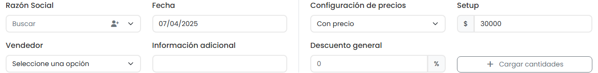

### v5

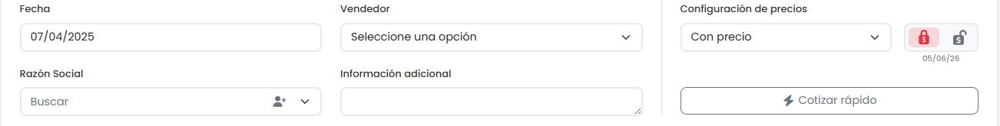

| Aspecto | v4 | v5 |
|---------|----|----|
| Layout | 50/50 | 66/33 (Información / Atajos globales) |
| Columna derecha | Setup, Descuento general, Cargar cantidades | Configuración de precios, lock/unlock, **Cotizar rápido** |
| Campo adicional | — | `informacionAdicional` como `<textarea>` |
| Títulos de sección | — | "Información" / "Atajos globales" |

**Eliminado en v5:** Descuento general, Setup global y botones "+ Cargar cantidades" del formulario (esas acciones pasan a la toolbar de selección).

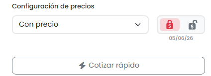

---

## 2. Toolbar de tabla — de barra fija a dos estados

### v4

**Barra única fija** con toggle "Precios actualizados", refresh, Ordenar, Agregar, Eliminar seleccionados.

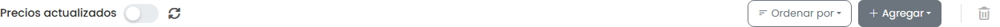

### v5

Toolbar de **dos estados** estilo Gmail (reemplaza la barra fija de v4).

**Estado por defecto** — Agregar + Ordenar por:

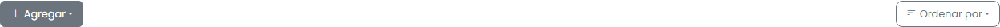

**Estado con selección** — barra azul con 6 acciones:


| Acción | UI | Lógica JS |
|--------|-----|-----------|
| Info adicional | Dropdown + Aplicar | ❌ Sin handler |
| Actualizar precios | Refresh | ⚠️ `price-update-indicator.js` |
| Setup | Dropdown $ + Aplicar | ❌ Sin handler |
| Descuento | Dropdown % + Aplicar | ❌ Sin handler |
| Cargar cantidades | Modal/offcanvas | ✅ Banner; guardar solo cierra |
| Eliminar | Botón rojo | ❌ Sin handler |

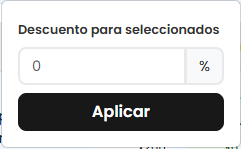
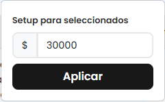
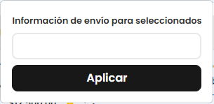

**Archivo nuevo:** `js-scripts/cotizacion-selection-toolbar.js`

**Removido en v5** (`15f8fa3`): fila de acciones `.flex-wrap` de v4, estilos de badges (`.discount-badge`, `.setup-badge`, `.envio-badge`), bloque `.toggle-switch-*` de `complementos.css`.

---

## 3. Selección múltiple y resaltado visual

La base de checkboxes viene de **Parte I (A-1)**. v5 extiende ese comportamiento (tabla comparativa en A-1).

### v4

Al seleccionar filas solo se habilita el botón eliminar; **sin highlight** en las filas.

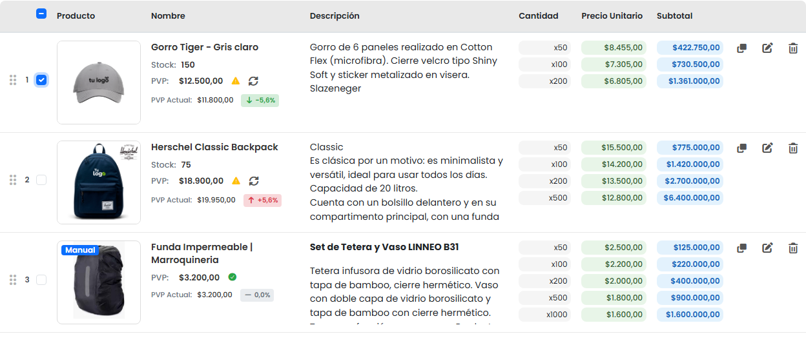

### v5 — resaltado visual (nuevo)

Clase `.row-selected`: borde azul + fondo `#eef4fc`.

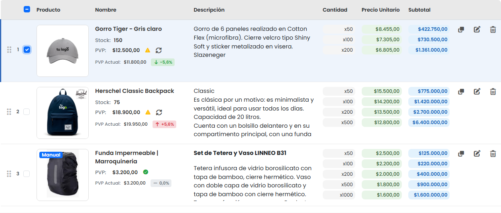

### Mobile — toolbar de selección (nuevo en v5)

Iconos + "Seleccionar todos":

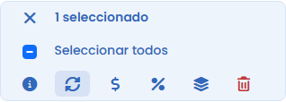

**Extensiones en** `cotizacion-items-checkboxes.js`: checkbox select-all en toolbar mobile, `window.cotizacionSelection` + evento `cotizacion-selection-changed`.

---

## 4. Control de precios — reubicado y rediseñado

### v4

Toggle texto "Precios actualizados" + botón refresh **sobre la tabla**.

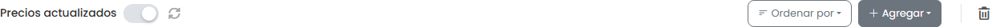

### v5

| Aspecto | v4 | v5 |
|---------|----|----|
| Ubicación | Sobre la tabla (toolbar fija) | Panel "Atajos globales" |
| Control | Toggle texto + refresh | Lock/unlock con iconos rojo/verde + fecha de bloqueo |
| JS | `#actualizarPreciosToggle` | `#preciosActualizadosOff` / `On`, `#preciosLockedDate`, tooltips PVP |

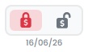
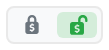

`price-update-indicator.js` fue reescrito para v5. El refresh en la toolbar de selección se integra con este nuevo control.

**Assets nuevos:** `IMG/lock-solid.svg`, `lock-open-solid.svg` (el HTML usa **SVG inline** en `detalle-cotizacion.html`; los archivos no están referenciados en el markup).

---

## 5. Modal "Cargar cantidades" — contexto visual

### v4

Botones **"Guardar cambios"** en el HTML, pero **sin IDs** y **sin handlers JS** conectados (no aplican cantidades). Sin banner de contexto.

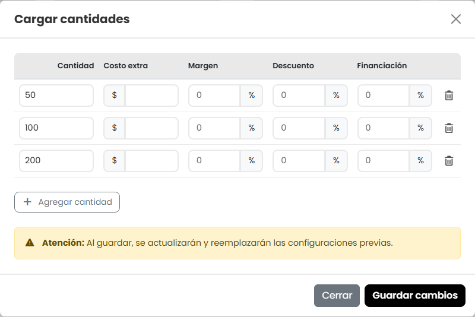

### v5

| Aspecto | v4 | v5 |
|---------|----|----|
| Banner de contexto | No | Sí — amarillo (global) o azul (selección) |
| Acceso global | Desde formulario | **Cotizar rápido** en Atajos globales |
| Acceso por selección | No | Desde toolbar de selección |
| Guardar cambios | Sin handler | Cierra el modal; no aplica cantidades |

**Cotizar rápido (global)** — banner amarillo (`.context-global`): *"Se aplicará a todos los productos de la cotización"*

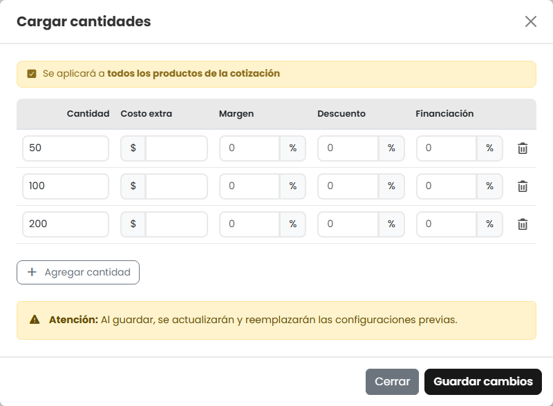

**Desde toolbar (selección)** — banner azul: *"Se aplicará a N ítems seleccionados"*

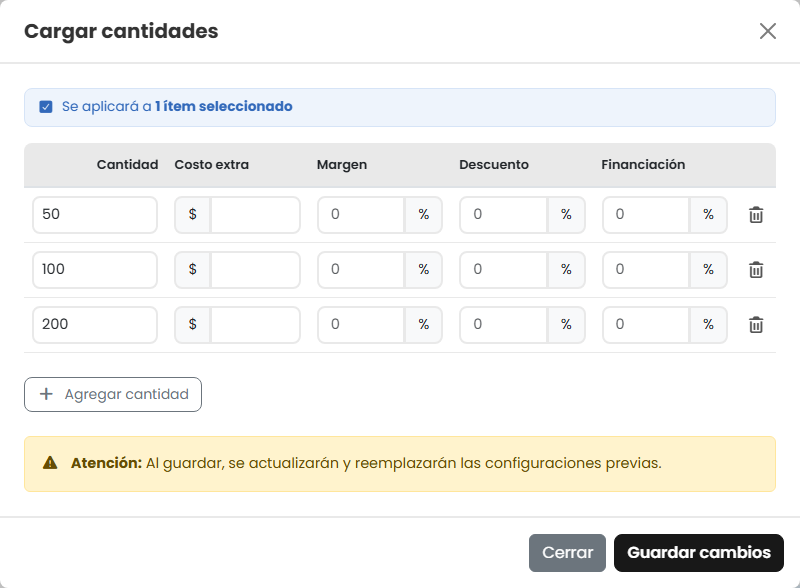

Alcance global vs selección determinado por el ID del botón (`btnCotizarRapido` / `btnCargarCantidadesSeleccion`).

---

## 6. Archivos — inventario Parte II

### Nuevos en v5

| Archivo | Propósito |
|---------|-----------|
| `js-scripts/cotizacion-selection-toolbar.js` | Toolbar contextual (mockup) |
| `IMG/lock-solid.svg`, `lock-open-solid.svg` | Assets de candado (no referenciados; HTML usa SVG inline) |

### Modificados en v5

| Archivo | Cambio |
|---------|--------|
| `detalle-cotizacion.html` / `.css` | Layout, toolbars, lock de precios, modales |
| `cotizacion-items-checkboxes.js` | API de selección, mobile select-all |
| `price-update-indicator.js` | Lock/unlock, fecha, tooltips |

### Removidos en v5 (`15f8fa3`)

- `js-scripts/PRODUCTION-GUIDE.md`
- `cursor_table_design_and_functionality_r.md`
- ~400 líneas de lógica en `cotizacion-selection-toolbar.js` (antes funcional, ahora mockup)

---

## Mapa visual

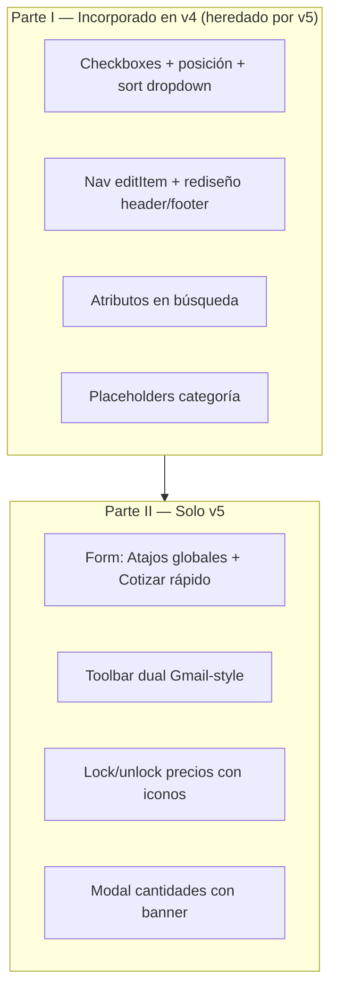

---

## Checklist de screenshots (Parte II)

| # | Archivo | Muestra |
|---|---------|---------|
| v4-01 | `v4-01-form-right-column.png` | Formulario con Setup, Descuento, Cantidades |
| v4-02 | `v4-02-table-toolbar.png` | Toolbar fija con toggle y eliminar |
| v4-03 | `v4-03-row-selected-delete-btn.png` | Fila seleccionada sin highlight |
| v4-04 | `v4-04-precios-actualizados-toggle.png` | Toggle activado |
| v4-05 | `v4-05-cantidades-modal.png` | Modal sin banner |
| v5-01 | `v5-01-atajos-globales.png` | Panel Atajos globales |
| v5-02 | `v5-02-default-toolbar.png` | Toolbar por defecto |
| v5-03 | `v5-03-selection-toolbar.png` | Toolbar de selección |
| v5-04 | `v5-04-row-selected-highlight.png` | Highlight azul |
| v5-05 | `v5-05-descuento-dropdown.png` | Dropdown descuento |
| v5-06 | `v5-06-setup-dropdown.png` | Dropdown setup |
| v5-07 | `v5-07-envio-dropdown.png` | Dropdown info adicional |
| v5-08 | `v5-08-cotizar-rapido-modal.png` | Modal global (amarillo) |
| v5-09 | `v5-09-cantidades-selection-modal.png` | Modal selección (azul) |
| v5-10 | `v5-10-precios-unlocked.png` | Precios desbloqueados |
| v5-11 | `v5-11-precios-locked-date.png` | Precios bloqueados + fecha |
| v5-12 | `v5-12-mobile-selection-toolbar.png` | Toolbar mobile |

Regenerar screenshots:

```powershell
cd "C:\Users\user\Desktop\Rediseños\Cotizacion\Cotizacion v5"
node capture-comparison.mjs
```

---

## Conclusión

- **Parte I** documenta las mejoras ya en el repo v4 (`be0259c`, `0a58554`) y heredadas por v5 — muchas **aún no comunicadas al equipo**: selección múltiple, reorden por posición, sort por dropdown, navegación entre ítems en edición, rediseño de editItem, atributos en búsqueda y placeholders por categoría.
- **Parte II** documenta el rediseño de `detalle-cotizacion` **solo en v5**: toolbar contextual, lock de precios, modales con alcance. La lógica de acciones masivas en v5 **aún es mockup** (`15f8fa3`).

**Próximo paso sugerido (v5):** conectar los handlers de `cotizacion-selection-toolbar.js` a la API de persistencia cuando esté definida.

---

## Otros archivos del repo (fuera de este doc)

| Archivo | Estado |
|---------|--------|
| `README.md` | Dice Font Awesome **6.4.0**; en el código es **7.0.1** — conviene actualizarlo. |
| `RESUMEN-MODIFICACIONES.md` | En carpeta padre `Cotizacion/`; contenido absorbido por este documento. |
