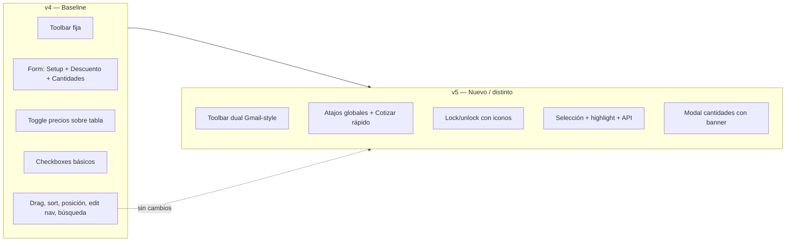

# Cotización — Comparación v4 vs v5

> **Actualizado:** junio 2026

Este documento compara **v4** (estado actual en producción) con **v5** (rediseño). Para cada área se describe primero qué hay en v4 y luego qué es nuevo o distinto en v5.

**Screenshots:** `comparison-screenshots/`

**Repositorios:**
- v4 → [Cotizador-V4](https://github.com/JPSformas/Cotizador-V4)
- v5 → [Cotizador-V5](https://github.com/JPSformas/Cotizador-V5)

---

## Resumen ejecutivo

| Área | v4 | v5 |
|------|----|----|
| Tabla de ítems | Drag, checkboxes, sort por dropdown, reorden por posición | Misma base + toolbar dual y selección mejorada |
| Toolbar de tabla | Barra única fija (precios, ordenar, agregar, eliminar) | Dos estados: normal / selección estilo Gmail |
| Formulario superior | Setup, descuento general, cargar cantidades en columna derecha | Atajos globales reducidos + Cotizar rápido |
| Precios | Toggle texto + refresh sobre la tabla | Lock/unlock con iconos en panel lateral |
| Acciones masivas | Botón eliminar se habilita al seleccionar (sin lógica de borrado) | 6 acciones en toolbar de selección — **mockup, sin aplicar cambios** |
| Layout formulario | 50/50 | 66/33 (Información / Atajos globales) |
| Modal cantidades | Sin banner de contexto | Banner azul (selección) o amarillo (global) |
| Edición de ítems | Nav anterior/siguiente, header/footer rediseñado | Sin cambios |
| Buscador de productos | Atributos visibles en preview | Sin cambios |
| Placeholders de categoría | 11 imágenes por categoría en `IMG/` | Sin cambios |

### Estado funcional de la toolbar v5 (importante)

`cotizacion-selection-toolbar.js` es un **mockup/prototipo** (~110 líneas):

> *"Las acciones de la toolbar y los modales de cantidades son solo visuales."*

| Funcionalidad | v5 |
|---------------|-----|
| Cambio de toolbar al seleccionar filas | ✅ Funciona |
| Highlight `.row-selected` en filas | ✅ Funciona |
| Contador "N seleccionados" + limpiar selección | ✅ Funciona |
| Banners de contexto en modal cantidades | ✅ Funciona |
| "Guardar cambios" en modal cantidades | ⚠️ Solo cierra el modal |
| Aplicar descuento / setup / envío | ❌ UI sin lógica |
| Eliminar filas seleccionadas | ❌ UI sin lógica |

Lo que **sí funciona** en v5 además del mockup: checkboxes, drag-and-drop, ordenamiento, modales de productos, navegación editItem, etc.

---

# v4 — Estado actual (baseline)

Lo que existe hoy en v4 y sirve como punto de partida para entender los cambios de v5.

---

## Tabla de ítems (`detalle-cotizacion`)

### Selección múltiple con checkboxes

**Archivo:** `js-scripts/cotizacion-items-checkboxes.js`

- Checkbox **"Seleccionar todos"** en el header de la tabla (estado *indeterminate* con selección parcial).
- Checkbox **individual** en cada fila, dentro de la columna del drag handle (`.dragItem-inner`).
- Botón **"Eliminar seleccionados"** (`#btnEliminarItemsSeleccionados`): arranca `disabled` y se habilita al tildar al menos un ítem. **No tiene lógica de borrado conectada.**
- Estilos de botón `disabled` en `styles/complementos.css`.

### Reordenar ítems por número de posición

**Archivo:** `js-scripts/item-position-reorder.js`

- Junto al drag handle aparece el **número de posición** (`1`, `2`, `3`…) como botón (`.item-position-display`).
- Al hacer click se convierte en **input numérico** (`.item-position-input`): el usuario escribe la posición destino y confirma con Enter o blur.
- Validación `min="1"`. Alternativa al drag, útil con muchos ítems o en mobile.
- Estilos en `styles/complementos.css`: hover, focus, `tabular-nums`, flechas del input number ocultas.

### Ordenamiento por dropdown

**Archivos:** `js-scripts/table-sorting.js`, `detalle-cotizacion.html`, `detalle-cotizacion.css`

Reemplaza el ordenamiento anterior por click en headers de "Nombre" y "Subtotal" (con íconos de flecha y ciclo asc/desc/neutral).

- Dropdown **"Ordenar por"** (`#dropdownOrdenarItems`) con opciones:
  - **Personalizado** (orden manual, activa por defecto)
  - **Nombre: A-Z** / **Nombre: Z-A**
  - **Precio PVP: Menor a mayor** / **Precio PVP: Mayor a menor**
- Eliminados de CSS: `.sortable-header`, `.sort-icon`.
- Agregado: `.dropdown-item.option.active` para la opción seleccionada.

### Drag and drop refactorizado

**Archivo:** `js-scripts/drag-and-drop-items.js`

- Función central `syncAfterReorder()` que:
  - Actualiza los `id="item-{n}"` de cada fila.
  - Guarda el nuevo orden.
  - Dispara el evento `cotizacion-items-reordered` con `detail.source` (`'user'` por drag, `'dropdown'` por sort).
- Expone `window.syncCotizacionItemOrderAfterReorder()` para que `table-sorting.js` lo invoque tras ordenar.
- `syncCotizacionItemEditNavFromTable()` mantiene sincronizada la cadena de navegación de edición (ver sección Edición de ítems).

### Toolbar y acciones sobre la tabla

- **Barra única fija** con: toggle "Precios actualizados", refresh, Ordenar, Agregar, Eliminar seleccionados.
- Fila de acciones con `flex-wrap gap-5` (responsive).
- Wrapper `.dragItem-inner`: drag handle + número de posición + checkbox.
- Drag handle con clase explícita `.drag-handle`.
- Ajustes responsive en `detalle-cotizacion.css` (grid area `drag`, alineación, gap en mobile).


### Formulario superior — columna derecha

Setup, **Descuento general** y **Cargar cantidades** en el formulario (layout 50/50).


### Control de precios

Toggle texto "Precios actualizados" + botón refresh **sobre la tabla**.

**Archivo:** `js-scripts/price-update-indicator.js` — cableado al toggle `#actualizarPreciosToggle` (sin fecha de bloqueo ni tooltips PVP).


### Modal "Cargar cantidades"

Botones **"Guardar cambios"** en el HTML, pero **sin IDs** y **sin handlers JS** conectados (no aplican cantidades). Sin banner de contexto.


### Selección visual

Al seleccionar filas solo se habilita el botón eliminar; **sin highlight** en las filas.


---

## Edición de ítems y buscador de productos

### Navegación entre ítems en pantalla de edición

**Archivo:** `js-scripts/cotizacion-edit-item-nav.js`

- Al editar un ítem se puede ir al **anterior / siguiente** sin volver al detalle.
- Funciona en `editItem.html` y `editItem-generico.html`.
- Cadena persistida en `localStorage` (`cotizacionEditNavChain`); ítem actual vía `?orden=N`.
- Botones `save&prevItemCotization` / `save&nextItemCotization` se deshabilitan en el primero/último ítem.
- Links "Editar" en `detalle-cotizacion.html` pasan `?orden=N`.
- `syncCotizacionItemEditNavFromTable()` en `drag-and-drop-items.js` sincroniza la cadena al cargar y tras cada reordenamiento.

### Header / footer de pantallas de edición

En `editItem.html` y `editItem-generico.html`:

- **"Guardar ítem de cotización"** arriba a la derecha (junto al breadcrumb), como `tf-btn` con ícono.
- Eliminado el bloque viejo de botones al pie del formulario.
- En el footer quedan **Ítem anterior** / **Ítem siguiente**, alineados a los extremos.

### Buscador de productos — Atributos en el preview

**Archivos:** `js-scripts/product-search.js`, `styles/product-search-preview.css`

- Función `formatProductAttributesLine(product)`:
  `Atributo 1: Valor · Atributo 2: Valor`
- Se muestra en cada tarjeta del resultado, entre SKU y stock.
- Solo si hay valores no vacíos.
- Estilo `.product-attributes` (mismo tamaño/color que el SKU).

### Placeholders de imagen por categoría

**Eliminados** los placeholders genéricos antiguos (`placeholderPIC.png`, `placeholderTextil.jpg`, etc.).

**11 placeholders por categoría** en `IMG/`:

- `H&B_placeholder.jpeg`, `Hogar&TLibre_placeholder.jpeg`, `drinkware_placeholder.jpeg`, `escritura_placeholder.jpeg`, `grafico-inst_placeholder.jpeg`, `llaveros_placeholder.jpeg`, `marroquineria_placeholder.jpeg`, `noestres_placeholder.jpeg`, `oficina_placeholder.jpeg`, `tecnologia_placeholder.jpeg`, `textil_placeholder.jpeg`

### Otros ajustes menores

- **Font Awesome** 7.0.1 en `detalle-cotizacion.html`, `editItem.html`, `editItem-generico.html`.
- `styles/complementos.css`: `.icon-button` de `1rem` a `0.9rem`.

---

# v5 — Qué hay de nuevo y qué cambió

Cambios de UI/UX en `detalle-cotizacion` sobre la base de v4. El trabajo principal está en `detalle-cotizacion.html`, `detalle-cotizacion.css` y `js-scripts/cotizacion-selection-toolbar.js`.

Commits v5 relevantes: `2d9a4e5` (inicial), `15f8fa3` (toolbar simplificada a mockup).

---

## Sin cambios respecto a v4

Estas funcionalidades se heredan de v4 y se comportan igual en v5:

| Funcionalidad | Archivos principales |
|---------------|---------------------|
| Reorden por número de posición | `item-position-reorder.js`, `complementos.css` |
| Ordenamiento por dropdown | `table-sorting.js`, `detalle-cotizacion.html/css` |
| Drag and drop + `syncAfterReorder` | `drag-and-drop-items.js` |
| Navegación entre ítems en edición | `cotizacion-edit-item-nav.js`, `editItem*.html` |
| Header/footer de editItem | `editItem.html`, `editItem-generico.html` |
| Atributos en búsqueda de productos | `product-search.js`, `product-search-preview.css` |
| Placeholders por categoría | `IMG/*_placeholder.jpeg` |

En v5 el dropdown "Ordenar por" vive en `#tableToolbarDefault` (toolbar sin selección), pero el comportamiento es el mismo.

---

## 1. Formulario superior — layout y atajos globales

### Qué cambió

| Aspecto | v4 | v5 |
|---------|----|----|
| Layout | 50/50 | 66/33 (Información / Atajos globales) |
| Columna derecha | Setup, Descuento general, Cargar cantidades | Configuración de precios, lock/unlock, **Cotizar rápido** |
| Campo adicional | — | `informacionAdicional` como `<textarea>` |
| Títulos de sección | — | "Información" / "Atajos globales" |

**Eliminado en v5:** Descuento general, Setup global y botones "+ Cargar cantidades" del formulario (esas acciones pasan a la toolbar de selección).


---

## 2. Toolbar de tabla — de barra fija a dos estados

### Qué cambió

v4 tiene una **barra única fija** con precios, ordenar, agregar y eliminar. v5 la reemplaza por una **toolbar de dos estados** estilo Gmail.

**Estado por defecto** — Agregar + Ordenar por:


**Estado con selección** — barra azul con 6 acciones:


| Acción | UI | Lógica JS |
|--------|-----|-----------|
| Info adicional | Dropdown + Aplicar | ❌ Sin handler |
| Actualizar precios | Refresh | ⚠️ `price-update-indicator.js` |
| Setup | Dropdown $ + Aplicar | ❌ Sin handler |
| Descuento | Dropdown % + Aplicar | ❌ Sin handler |
| Cargar cantidades | Modal/offcanvas | ✅ Banner; guardar solo cierra |
| Eliminar | Botón rojo | ❌ Sin handler |


**Archivo nuevo:** `js-scripts/cotizacion-selection-toolbar.js`

**Removido en v5** (`15f8fa3`): fila de acciones `.flex-wrap` de v4, estilos de badges (`.discount-badge`, `.setup-badge`, `.envio-badge`), bloque `.toggle-switch-*` de `complementos.css`.

---

## 3. Selección múltiple — mejoras sobre v4

v4 ya tenía checkboxes y un botón eliminar que se habilitaba al seleccionar. v5 extiende ese comportamiento:

| Aspecto | v4 | v5 |
|---------|----|----|
| Select-all | Solo en header de tabla | Header + checkbox en toolbar mobile |
| Al seleccionar | Habilita botón eliminar | Evento `cotizacion-selection-changed`, swap de toolbar, highlight `.row-selected` |
| API JS | No expone API | `window.cotizacionSelection` (`getSelectedRows`, `clearSelection`, `refresh`) |
| Eliminar | Botón en barra fija; sin lógica de borrado | Botón en toolbar de selección; sin lógica de borrado (mockup) |

### Resaltado visual de filas (nuevo en v5)

Clase `.row-selected`: borde azul + fondo `#eef4fc`.


### Mobile — toolbar de selección (nuevo en v5)

Iconos + "Seleccionar todos":


**Extensiones en** `cotizacion-items-checkboxes.js`: checkbox select-all en toolbar mobile, `window.cotizacionSelection` + evento `cotizacion-selection-changed`.

---

## 4. Control de precios — reubicado y rediseñado

| Aspecto | v4 | v5 |
|---------|----|----|
| Ubicación | Sobre la tabla (toolbar fija) | Panel "Atajos globales" |
| Control | Toggle texto + refresh | Lock/unlock con iconos rojo/verde + fecha de bloqueo |
| JS | `#actualizarPreciosToggle` | `#preciosActualizadosOff` / `On`, `#preciosLockedDate`, tooltips PVP |


`price-update-indicator.js` fue reescrito para v5. El refresh en la toolbar de selección se integra con este nuevo control.

**Assets nuevos:** `IMG/lock-solid.svg`, `lock-open-solid.svg` (el HTML usa **SVG inline** en `detalle-cotizacion.html`; los archivos no están referenciados en el markup).

---

## 5. Modal "Cargar cantidades" — contexto visual

| Aspecto | v4 | v5 |
|---------|----|----|
| Banner de contexto | No | Sí — amarillo (global) o azul (selección) |
| Acceso global | Desde formulario | **Cotizar rápido** en Atajos globales |
| Acceso por selección | No | Desde toolbar de selección |
| Guardar cambios | Sin handler | Cierra el modal; no aplica cantidades |

**Cotizar rápido (global)** — banner amarillo (`.context-global`): *"Se aplicará a todos los productos de la cotización"*


**Desde toolbar (selección)** — banner azul: *"Se aplicará a N ítems seleccionados"*


Alcance global vs selección determinado por el ID del botón (`btnCotizarRapido` / `btnCargarCantidadesSeleccion`).

---

## Archivos — inventario de cambios v5

### Nuevos en v5

| Archivo | Propósito |
|---------|-----------|
| `js-scripts/cotizacion-selection-toolbar.js` | Toolbar contextual (mockup) |
| `IMG/lock-solid.svg`, `lock-open-solid.svg` | Assets de candado (no referenciados; HTML usa SVG inline) |

### Modificados en v5

| Archivo | Cambio |
|---------|--------|
| `detalle-cotizacion.html` / `.css` | Layout, toolbars, lock de precios, modales |
| `cotizacion-items-checkboxes.js` | API de selección, mobile select-all |
| `price-update-indicator.js` | Lock/unlock, fecha, tooltips |

### Removidos en v5 (`15f8fa3`)

- `js-scripts/PRODUCTION-GUIDE.md`
- `cursor_table_design_and_functionality_r.md`
- ~400 líneas de lógica en `cotizacion-selection-toolbar.js` (antes funcional, ahora mockup)

---

## Mapa visual



---

## Checklist de screenshots

| # | Archivo | Muestra |
|---|---------|---------|
| v4-01 | `v4-01-form-right-column.png` | Formulario con Setup, Descuento, Cantidades |
| v4-02 | `v4-02-table-toolbar.png` | Toolbar fija con toggle y eliminar |
| v4-03 | `v4-03-row-selected-delete-btn.png` | Fila seleccionada sin highlight |
| v4-04 | `v4-04-precios-actualizados-toggle.png` | Toggle activado |
| v4-05 | `v4-05-cantidades-modal.png` | Modal sin banner |
| v5-01 | `v5-01-atajos-globales.png` | Panel Atajos globales |
| v5-02 | `v5-02-default-toolbar.png` | Toolbar por defecto |
| v5-03 | `v5-03-selection-toolbar.png` | Toolbar de selección |
| v5-04 | `v5-04-row-selected-highlight.png` | Highlight azul |
| v5-05 | `v5-05-descuento-dropdown.png` | Dropdown descuento |
| v5-06 | `v5-06-setup-dropdown.png` | Dropdown setup |
| v5-07 | `v5-07-envio-dropdown.png` | Dropdown info adicional |
| v5-08 | `v5-08-cotizar-rapido-modal.png` | Modal global (amarillo) |
| v5-09 | `v5-09-cantidades-selection-modal.png` | Modal selección (azul) |
| v5-10 | `v5-10-precios-unlocked.png` | Precios desbloqueados |
| v5-11 | `v5-11-precios-locked-date.png` | Precios bloqueados + fecha |
| v5-12 | `v5-12-mobile-selection-toolbar.png` | Toolbar mobile |

Regenerar screenshots:

```powershell
cd "C:\Users\user\Desktop\Rediseños\Cotizacion\Cotizacion v5"
node capture-comparison.mjs
```

---

## Conclusión

- **v4** documenta el estado actual: tabla con checkboxes, reorden por posición, sort por dropdown, toolbar fija, formulario con atajos globales, navegación entre ítems, búsqueda con atributos y placeholders por categoría.
- **v5** añade el rediseño de `detalle-cotizacion`: toolbar contextual, lock de precios, modales con alcance visual. La lógica de acciones masivas en v5 **aún es mockup** (`15f8fa3`).

**Próximo paso sugerido (v5):** conectar los handlers de `cotizacion-selection-toolbar.js` a la API de persistencia cuando esté definida.

---

## Otros archivos del repo (fuera de este doc)

| Archivo | Estado |
|---------|--------|
| `README.md` | Dice Font Awesome **6.4.0**; en el código es **7.0.1** — conviene actualizarlo. |
| `RESUMEN-MODIFICACIONES.md` | En carpeta padre `Cotizacion/`; contenido absorbido por este documento. |
